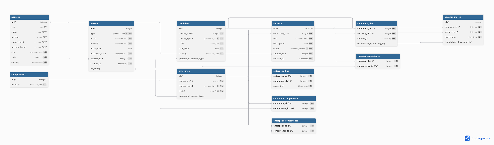

# Linketinder
Desenvolvido por **Maria Julia Sales**.

O **Linketinder** é um "LinkedIn + Tinder" para vagas de emprego: conecta candidatos e empresas pelas
**competências técnicas**, de forma **anônima**. O candidato vê as vagas sem saber qual empresa as publicou. A empresa vê os candidatos sem nome nem dados pessoais, só formação, descrição e competências.
A identidade dos dois lados só seria revelada depois de um *match*.

O projeto tem três partes:

| Parte | Pasta | O que é |
|-------|-------|---------|
| **Backend** | [`Linketinder/`](Linketinder/) | Aplicação de terminal em **Groovy**, com menu interativo, regras de negócio, validações e testes unitários |
| **Frontend** | [`Frontend/`](Frontend/) | Aplicação web em **TypeScript + Vite + Bootstrap**, com cadastro, login, listagens anônimas e gráfico de competências |
| **Banco de dados** | [`Database/`](Database/) | Modelagem (DER) e SQL do banco **PostgreSQL**: tabelas, curtidas, match e consultas de teste. |

> O backend salva os dados no banco PostgreSQL (JDBC). O frontend ainda não se comunica com o backend.


---

## Sumário

- [Backend (Groovy)](#backend-groovy)
  - [Tecnologias](#tecnologias)
  - [Arquitetura](#arquitetura)
  - [Integração com o banco (JDBC)](#integração-com-o-banco-jdbc)
  - [Modelo de domínio](#modelo-de-domínio)
  - [Funcionalidades do menu](#funcionalidades-do-menu)
  - [Validações](#validações)
  - [Testes](#testes)
  - [Estrutura do backend](#estrutura-do-backend)
  - [Como executar o backend](#como-executar-o-backend)
- [Frontend (TypeScript)](#frontend-typescript)
  - [Tecnologias](#tecnologias-1)
  - [Telas](#telas)
  - [Funcionalidades](#funcionalidades)
  - [Anonimato](#anonimato)
  - [Persistência](#persistência)
  - [Estrutura do frontend](#estrutura-do-frontend)
  - [Como executar o frontend](#como-executar-o-frontend)
- [Banco de dados (PostgreSQL)](#banco-de-dados-postgresql)
  - [Tecnologias](#tecnologias-2)
  - [DER](#der)
  - [Lógica do match](#lógica-do-match)
  - [Regras do banco](#regras-do-banco)
  - [Estrutura do banco](#estrutura-do-banco)
  - [Como executar o banco](#como-executar-o-banco)

---

## Backend (Groovy)

Aplicação de terminal com o CRUD de candidatos, empresas, vagas e competências. Os dados são salvos no
banco **PostgreSQL** (pasta [`Database/`](Database/)) por meio de JDBC.

### Tecnologias

* **Linguagem:** Groovy 5 (Java JDK 17+)
* **Build:** Gradle (com Gradle Wrapper)
* **Banco:** PostgreSQL 18, acessado por JDBC (driver `org.postgresql:postgresql`)
* **Testes:** Spock Framework 2.4 sobre JUnit Platform
* **Conceitos:** orientação a objetos (interface, classe abstrata e herança), camada de serviços, DAO, DTOs,
  mappers, enums, records, transações e expressões regulares

### Arquitetura

O código é separado em camadas, cada uma com uma responsabilidade:

| Camada | Classes | Responsabilidade |
|--------|---------|------------------|
| **Menu** | `Menu`, `View` | Interação com o usuário no terminal |
| **Service** | `CandidateService`, `EnterpriseService`, `VacancyService`, `CompetenceService` | Regras de negócio e validações antes de salvar |
| **DAO** | `DatabaseConnection`, `CandidateDAO`, `EnterpriseDAO`, `VacancyDAO`, `CompetenceDAO`, `PersonDAO`, `AddressDAO` | Conexão com o banco e o SQL de cada CRUD |
| **Model** | `Person`, `PersonAbstract`, `Address`, `Candidate`, `Enterprise`, `Vacancy`, `Competence`, `VacancyStatus` | Entidades do domínio |
| **DTO** | `CandidateRequest`, `AddressRequest`, `CandidateResponse`, `CandidateAnonymousResponse`, `AddressResponse` | Objetos de entrada e saída de dados |
| **Mapper** | `CandidateMapper`, `AddressMapper` | Converte entre DTOs e as entidades `Candidate` e `Address` |
| **Util** | `ValidateUtil` | Validação de CPF, CNPJ, e-mail, senha, CEP e UF |

O `Main` monta as dependências (`DatabaseConnection` → DAOs → serviços → `Menu`) e inicia o menu.

### Integração com o banco (JDBC)

- **`DatabaseConnection`** abre as conexões com `DriverManager` e oferece dois métodos:
  `withConnection` (abre, usa e fecha a conexão) e `withTransaction` (faz `commit` se tudo der certo e
  `rollback` se algo falhar).
- **Um DAO por tabela principal**, com `create`, `findAll`, `findById`, `update` e `delete`. Todo o SQL usa
  `PreparedStatement`, que evita SQL injection.
- **Candidato e empresa** gravam em várias tabelas (`address` → `person` → `candidate`/`enterprise` → competências)
  dentro de **uma transação**: ou tudo é salvo, ou nada. A parte comum fica em `PersonDAO`, assim como
  `PersonAbstract` é a parte comum dos modelos.
- **Relação N:N com competências:** `CompetenceDAO.replaceLinks` grava as ligações em `candidate_competence`,
  `enterprise_competence` e `vacancy_competence`. Uma competência digitada que ainda não existe é criada na hora
  (ex.: "Ilustrador"), e "java" é reconhecida como "Java".
- **Relação 1:N empresa → vagas:** cada `Vacancy` guarda a sua `Enterprise`, e `VacancyDAO.findByEnterprise`
  lista as vagas de uma empresa. Excluir a empresa exclui as vagas dela (cascade no banco).
- **Senha** gravada como hash bcrypt pelo próprio PostgreSQL (`crypt(?, gen_salt('bf'))`).
- **Erros do banco** (e-mail/CPF/CNPJ repetido, competência em uso) viram mensagens claras no menu.

### Modelo de domínio

```text
Person (interface)
   └── PersonAbstract (classe abstrata: id, name, email, password, description, address, competences)
          ├── Candidate  (+ cpf, birthDate, training; a idade é calculada)
          └── Enterprise (+ cnpj)

Address (id, cep, street, number, complement, neighborhood, city, state, country) — endereço de pessoas e vagas
Vacancy (id, title, description, competences, status, address, enterprise)
Competence (classe: id, name) — lista pré-definida no banco + competências digitadas pelos usuários
VacancyStatus (enum): OPEN, CLOSED, PAUSED
```

Cada pessoa sabe exibir o próprio perfil anônimo (`viewProfileAnonymous`), e cada vaga sabe exibir
sua versão anônima (`viewVacancyAnonymous`), sem os dados da empresa.

### Funcionalidades do menu

```text
Bem vindo(a) ao LinkeTinder!
1. Candidatos       → listar (anônimo), ver perfil completo, cadastrar, atualizar, excluir
2. Empresas         → listar, ver dados completos, cadastrar, atualizar, excluir (com as vagas)
3. Vagas            → listar todas, listar as de uma empresa, cadastrar, atualizar, excluir
4. Competências     → listar, cadastrar, renomear, excluir
0. Sair do programa.
```

- **Listar candidatos:** mostra só formação, descrição e competências (`CandidateAnonymousResponse`), sem nome,
  e-mail, CPF ou endereço.
- **Cadastrar:** pede os dados no terminal, valida e salva no banco. As competências disponíveis são mostradas, e
  o usuário digita as suas separadas por vírgula, podendo escrever competências novas.
- **Atualizar:** mostra o valor atual de cada campo entre colchetes; **Enter mantém o valor**. A senha só muda
  se uma nova for digitada.
- **Excluir competência:** o banco recusa se ela estiver em uso por algum candidato, empresa ou vaga.

### Validações

| Onde | Regra |
|------|-------|
| `CandidateService` | **CPF**, **e-mail**, **senha** (6+ caracteres), nome, endereço (**CEP**, cidade/**UF**), data de nascimento e formação |
| `EnterpriseService` | **CNPJ**, **e-mail**, **senha** (6+ caracteres), nome e endereço (**CEP** e cidade/**UF**) |
| `VacancyService` | **Título**, **ao menos uma competência**, **empresa**, descrição e endereço (cidade/**UF**); a busca por ID exige ID positivo e existente |
| `CompetenceService` | Nome não vazio, com até 50 caracteres e que ainda não exista |
| `ValidateUtil` | **CPF:** formato com ou sem pontuação, rejeita dígitos todos iguais e confere os dígitos verificadores. **CNPJ:** aceita também o formato **alfanumérico** e confere os dígitos verificadores. **E-mail:** expressão regular. **CEP:** 8 dígitos. **UF:** 2 letras |

Quando uma regra é violada, o serviço lança `IllegalArgumentException` com uma mensagem explicando o erro,
e o menu mostra essa mensagem sem encerrar o programa. Na atualização, a senha é opcional.

### Testes

Os serviços têm testes unitários com **Spock** (`src/test/groovy/.../service/`). Os DAOs são substituídos por
**mocks**, então os testes rodam sem precisar do banco:

| Especificação | O que testa |
|---------------|-------------|
| `CandidateServiceSpec` | Criação válida e inválida (CPF, e-mail, senha, endereço — CEP, UF, cidade —, data de nascimento, formação, nome), listagem, busca, atualização e exclusão |
| `EnterpriseServiceSpec` | Criação válida e inválida (CNPJ, e-mail, senha, endereço — CEP, UF, cidade —, nome), listagem, busca, atualização e exclusão |
| `VacancyServiceSpec` | Criação válida e inválida (empresa, título, competências, descrição, local), listagem, busca, vagas por empresa, atualização e exclusão |
| `CompetenceServiceSpec` | Criação (nova, repetida e com nome inválido), listagem, busca, renomear, exclusão e igualdade sem diferenciar maiúsculas |

São **96 casos de teste** no total, todos passando.

### Estrutura do backend

```text
Linketinder/
├── build.gradle
├── settings.gradle
├── gradlew / gradlew.bat
└── src/
    ├── main/groovy/com/mariajuliasales/
    │   ├── Main.groovy
    │   ├── menu/         Menu.groovy, View.groovy
    │   ├── service/      CandidateService.groovy, EnterpriseService.groovy, VacancyService.groovy,
    │   │                 CompetenceService.groovy
    │   ├── dao/          DatabaseConnection.groovy, CandidateDAO.groovy, EnterpriseDAO.groovy,
    │   │                 VacancyDAO.groovy, CompetenceDAO.groovy, PersonDAO.groovy, AddressDAO.groovy
    │   ├── model/        Person.groovy, PersonAbstract.groovy, Address.groovy, Candidate.groovy, Enterprise.groovy,
    │   │                 Vacancy.groovy, Competence.groovy, VacancyStatus.groovy
    │   ├── dto/
    │   │   ├── request/  CandidateRequest.groovy, AddressRequest.groovy
    │   │   └── response/ CandidateResponse.groovy, CandidateAnonymousResponse.groovy, AddressResponse.groovy
    │   ├── mapper/       CandidateMapper.groovy, AddressMapper.groovy
    │   └── util/         ValidateUtil.groovy
    └── test/groovy/com/mariajuliasales/service/
        ├── CandidateServiceSpec.groovy
        ├── EnterpriseServiceSpec.groovy
        ├── VacancyServiceSpec.groovy
        └── CompetenceServiceSpec.groovy
```

### Como executar o backend

**Pré-requisitos:** Java JDK 17 ou superior e o banco PostgreSQL criado e populado
(veja [Como executar o banco](#como-executar-o-banco)). Não é preciso instalar o Gradle, pois o projeto usa o Gradle Wrapper.

```bash
git clone https://github.com/mariajuliasales/Linketinder-Project.git
cd Linketinder-Project/Linketinder

./gradlew build   # compila e roda os testes (não precisa do banco)
./gradlew run     # abre o menu no terminal (precisa do banco rodando)
./gradlew test    # só os testes
```

Por padrão, a aplicação conecta em `jdbc:postgresql://localhost:5432/linketinder` com usuário e senha
`postgres`. Para usar outros valores, defina as variáveis de ambiente antes do `run`:

```bash
export DB_URL=jdbc:postgresql://localhost:5432/linketinder
export DB_USER=postgres
export DB_PASSWORD=sua_senha
```

No Windows, use `gradlew.bat` no lugar de `./gradlew`.

---

## Frontend (TypeScript)

Aplicação web de página única em que candidatos e empresas se cadastram, entram com e-mail e senha
e veem uns aos outros de forma anônima.

### Tecnologias

* **Linguagem:** TypeScript 6
* **Build e servidor de desenvolvimento:** Vite 8
* **Estilo:** Bootstrap 5.3
* **APIs do navegador:** DOM e LocalStorage 

### Telas

| Endereço | Tela | Quem acessa |
|----------|------|-------------|
| `#/home` | **Página inicial:** apresentação, números da plataforma, "Como funciona" e chamadas para cadastro | Todos |
| `#/register` | **Cadastro:** um só formulário, com a escolha "Sou candidato" ou "Sou empresa" | Todos |
| `#/login` | **Login** com e-mail e senha | Todos |
| `#/vacancies` | **Vagas:** todas as vagas abertas, sem dados da empresa | Candidato logado |
| `#/candidates` | **Candidatos:** tabela de candidatos anônimos e gráfico de candidatos por competência | Empresa logada |
| `#/my-vacancies` | **Minhas vagas:** publicar e excluir as vagas da empresa | Empresa logada |

Quem tenta abrir uma página restrita sem estar logado (ou logado com o tipo errado) é levado ao login.

### Funcionalidades

- **Cadastro (Create):**
  - campos comuns: nome, e-mail, senha, endereço (CEP, cidade, UF e país), descrição opcional e competências;
  - candidato informa também CPF, data de nascimento (mínimo de 16 anos) e formação; empresa informa o CNPJ;
  - validação com Bootstrap (campos obrigatórios, formato de CPF, CNPJ e CEP, ao menos uma competência);
  - o e-mail não pode se repetir entre candidatos e empresas;
  - após o cadastro, o usuário já entra logado.
- **Login e logout:** com e-mail e senha; após entrar, o candidato vai para as vagas e a empresa para os candidatos.
- **Vagas (candidato):** cards com título, local, descrição e competências; as competências que o
  candidato tem aparecem em **verde**.
- **Candidatos (empresa):** tabela com "Candidato #N", formação, descrição e competências.
- **Gráfico de competências (empresa):** barras horizontais com quantos candidatos têm cada competência.
- **Janelas de informação ao passar o mouse** (ou ao navegar com Tab):
  - sobre um **candidato** na tabela: formação, descrição, competências e quantas delas a empresa busca;
  - sobre uma **vaga**: detalhes e quantas competências pedidas o candidato tem;
  - sobre uma **barra do gráfico**: quantos candidatos têm aquela competência e o percentual do total;
  - nome e contato aparecem como "🔒 revelados após o match".
- **Minhas vagas (Create e Delete):** a empresa publica vagas (título, descrição, cidade, UF e
  competências) e exclui as próprias vagas.
- **Excluir conta (Delete):** candidato e empresa podem excluir a própria conta; ao excluir uma empresa,
  as vagas dela também são excluídas. Toda exclusão pede confirmação.

**Contas de teste** (senha `123456` para todas):

| Tipo | E-mail |
|------|--------|
| Candidato | `mariajuliasales@gmail.com` |
| Empresa | `contato@techsolutions.com.br` |

### Anonimato

O anonimato é garantido **pelo tipo**, não só pela tela. As páginas de listagem recebem apenas versões
reduzidas dos dados, criadas campo a campo em `services.ts`:

- `CandidateAnonymous` → só `training`, `description` e `competencies`.
  Nome, e-mail, CPF, data de nascimento e endereço não chegam à tela da empresa.
- `VacancyAnonymous` → só `title`, `description`, `city`, `state` e `competencies`.
  O vínculo com a empresa (`enterpriseId`) não chega à tela do candidato.


### Persistência

Os dados ficam no **LocalStorage** do navegador. Na primeira visita, a aplicação grava os dados de exemplo
(5 candidatos, 5 empresas e 5 vagas).

> As senhas ainda são guardadas **sem criptografia**, porque é só uma demonstração do frontend.

### Estrutura do frontend

```text
Frontend/
├── index.html
├── package.json
├── tsconfig.json
└── src/
    ├── main.ts           # rotas por hash e navbar
    ├── types.ts          # tipos do domínio e listas fixas (competências e UFs)
    ├── seed.ts           # dados de exemplo
    ├── storage.ts        # único acesso ao LocalStorage (dados e sessão)
    ├── services.ts       # cadastro, login, exclusões, vagas, listagens anônimas e contagens
    ├── dom.ts            # helpers de DOM e janela de informações
    ├── style.css         # ajustes visuais sobre o Bootstrap
    └── pages/
        ├── home.ts
        ├── register.ts
        ├── login.ts
        ├── vacancies.ts
        ├── candidates.ts 
        └── myVacancies.ts
```

O fluxo é sempre `pages` → `services` → `storage`.

### Como executar o frontend

**Pré-requisito:** Node.js 20.19+ ou 22.12+ (exigência do Vite 8).

```bash
cd Linketinder-Project/Frontend

npm install       # instala as dependências
npm run dev       # http://localhost:5173
```

---

## Banco de dados (PostgreSQL)

Modelagem e SQL do banco do Linketinder. O banco tem dados de exemplo e consultas de teste, e é usado pelo
backend por meio de JDBC (veja [Integração com o banco (JDBC)](#integração-com-o-banco-jdbc)).

### Tecnologias

* **Banco:** PostgreSQL 18
* **Modelagem:** DBML, com o diagrama gerado no [dbdiagram.io](https://dbdiagram.io)
* **Senhas:** extensão `pgcrypto` (hash bcrypt)

### DER



O modelo completo está em [`Database/linketinder.dbml`](Database/linketinder.dbml).


### Lógica do match

1. O candidato vê as vagas sem os dados da empresa e curte uma vaga (`candidate_like`).
2. A empresa vê os candidatos sem nome nem dados pessoais e curte um candidato (`enterprise_like`).
3. Há match quando o candidato curtiu a vaga e a empresa dona dessa vaga curtiu o candidato.
   A ordem das curtidas não importa. O match é gravado em `vacancy_match`.
4. Se o candidato remover a curtida, o match é apagado junto.
5. Só depois do match os dados de identificação (nome, e-mail) são mostrados para o outro lado.

### Regras do banco

| Regra | Como |
|-------|------|
| Uma pessoa é candidato ou empresa| FK composta `(person_id, person_type)` → `person(id, type)` |
| E-mail, CPF, CNPJ e nome da competência não se repetem | `UNIQUE` |
| Uma curtida por candidato/vaga e por empresa/candidato | Chave primária composta |
| Não existe match sem a curtida do candidato | FK de `vacancy_match` para `candidate_like` |
| Excluir uma pessoa apaga em cascata o candidato/empresa, as vagas, as curtidas e os matches | `ON DELETE CASCADE` |
| Endereço e competência em uso não podem ser apagados | `ON DELETE RESTRICT` |
| A senha nunca é gravada em texto | Hash bcrypt com `crypt()` |

### Estrutura do banco

```text
Database/
├── linketinder.dbml       # modelo do banco (DER em DBML)
├── DER-Linketinder.png    # imagem do DER
├── schema.sql             # criação das tabelas, constraints e índices
├── seed.sql               # dados de exemplo
├── queries.sql            # consultas que testam as relações, as curtidas e o match
```

### Como executar o banco

**Pré-requisito:** PostgreSQL instalado e rodando (porta padrão 5432).

```bash
cd Linketinder-Project/Database
export PGPASSWORD=suasenha  

createdb -h localhost -U postgres linketinder                          # cria o banco (só na primeira vez)
psql -h localhost -U postgres -d linketinder -f schema.sql             # cria as tabelas
psql -h localhost -U postgres -d linketinder -f seed.sql               # insere os dados de exemplo
psql -h localhost -U postgres -d linketinder -P pager=off -f queries.sql  # roda as consultas de teste
```

---